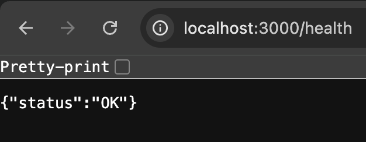
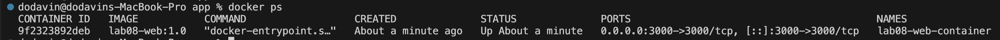
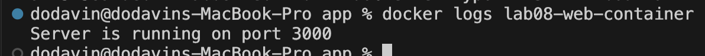

1. Docker (Image, Container), Custome Image

* An Image = a template (like a "blueprint") used to create containers.

* A Container = a running instance created from an image.

* Common Command:
```docker
docker images
docker ps
docker ps -a
```








2. Docker-compose
3. Networks
5. Implement case study